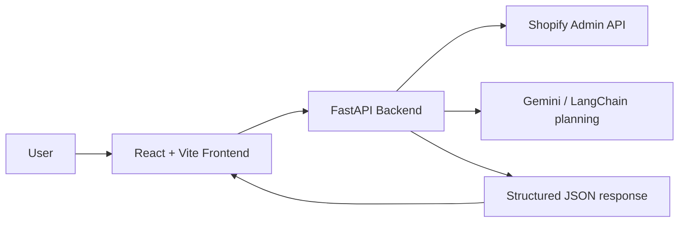

# Shopify AI Agent

Shopify AI Agent is a read-only analytics product that answers natural-language questions about a Shopify store, fetches live store data, and renders the result as text, tables, and charts.

## What the product does

The app lets a user ask questions such as:

- How many orders were placed in the last 7 days?
- Which products sold the most last month?
- Who are my repeat customers?
- Show revenue by city.

The backend resolves the question against live Shopify Admin API data, computes the analysis, and returns a structured response for the frontend.

## Architecture



### Backend

- FastAPI serves the `/health` and `/api/ask` endpoints.
- `ShopifyClient` fetches live orders, products, and customers.
- `agent_production.py` routes a question to the right data fetcher, applies filtering, and shapes the final answer.
- Response payloads contain `answer`, `table`, `chart`, `warnings`, and `raw_output` so the UI can render multiple views of the same result.

### Frontend

- React 19 + Vite powers the UI.
- The app posts questions to the backend and renders the answer, a table, and a chart if the response includes them.
- The deployed frontend uses `https://shopify-ai-agent-h9x5.onrender.com` by default for API calls, while local development can still override this with `VITE_API_BASE_URL`.

## Technology choices

### FastAPI

FastAPI was used because it is lightweight, typed, fast, and ideal for JSON APIs that need predictable schemas and clear validation.

### Shopify Admin API + httpx

The Shopify Admin API provides the source of truth. `httpx` was used because it gives straightforward control over retries, pagination, headers, and error handling.

### Pydantic

Pydantic powers request and response validation so the backend always returns a stable contract to the UI.

### React + Vite

React keeps the UI composable, while Vite keeps local iteration fast and makes the frontend build simple for deployment.

### LangChain + Gemini

These are used for agentic planning and question interpretation, but the final answer is grounded in live Shopify data rather than canned content.

## Approach followed

1. Removed fake sample responses and replaced them with live Shopify data fetches.
2. Added robust pagination and retry handling for the Shopify API.
3. Sliced order data by time window after fetching real records so recent-period questions still work reliably.
4. Standardized backend responses into a UI-friendly schema.
5. Connected the frontend to the backend with a small API client and a Vite dev proxy.
6. Prepared the project for deployment on Render with separate frontend and backend services.
7. Updated the UI to a minimal black-and-white layout with a full-width question composer.

## How the main problems were solved

### Dummy values removed

The earlier hardcoded agent output was replaced with live calls to Shopify so the product now returns actual store data instead of fake counts or fixed revenue values.

### Order windows became reliable

Instead of depending on a narrow API date filter, orders are fetched first and then filtered locally for the requested window. That made last-7-days and last-month queries much more dependable.

### Frontend/backend connectivity

The frontend was changed to use a relative API strategy in development and a deployed backend URL in production. Vite proxying also removed the connection-refused issue during local dev.

### CORS on deployed frontend

The backend now allows the deployed Vercel origin and also supports a `FRONTEND_ORIGINS` environment variable so new preview URLs can be added without code changes.

### Security cleanup

Secrets were removed from docs and history was cleaned so exposed keys are not left in the repository.

## Project structure

- `backend/` FastAPI backend, Shopify client, agent logic, schemas, and tests
- `frontend/` React UI, API client, types, and styling
- `package.json` monorepo helper scripts for build and start flows
- `.env` local secrets only, never committed

## Local development

### Backend

```powershell
cd backend
python -m pip install -r requirements.txt
uvicorn app.main:app --reload --port 8000
```

### Frontend

```powershell
cd frontend
npm install
npm run dev
```

## Deployment summary

- **Backend**: Render Web Service
- **Frontend**: Render Static Site or another static host such as Vercel
- **Backend start command**: `uvicorn app.main:app --host 0.0.0.0 --port $PORT`
- **Frontend API base**: `https://shopify-ai-agent-h9x5.onrender.com`

## If more time were available

- Add caching for repeated Shopify queries.
- Add more charts and richer drill-downs.
- Improve observability with request tracing and structured logs.
- Add automated tests for more question types and response shapes.
- Add a better loading state and skeleton UI for large queries.
- Expand tool routing so the agent can support more business questions with fewer assumptions.

## Environment

The repository expects Shopify credentials and optional Gemini settings in the root `.env` file.

## AWS Architecture Prompt

Use the following prompt template when you want a clear AWS architecture, diagram, and deployment plan for this project. It guides an LLM or architecture tool to produce a complete solution including resources, cost considerations, security, and IaC snippets.

Prompt template (copy/paste):

"You are an experienced AWS solutions architect. Design a production-ready AWS architecture for a read-only Shopify analytics agent with a FastAPI backend and a React + Vite frontend. Provide a high-level diagram (list nodes and connections), a concise justification for each AWS service chosen, security controls, scalability patterns, monitoring/observability, backup and recovery strategy, cost optimization recommendations, and a minimal Terraform or CloudFormation snippet to provision the core infrastructure.

Requirements and constraints:
- Backend: FastAPI app (uvicorn/gunicorn), expected moderate traffic (10-500 RPS), needs secure access to Shopify Admin API via a secret token.
- Frontend: Static React site that must be served with a CDN and supports custom domain and TLS.
- Data: No persistent write-heavy store required; caching of Shopify responses is desirable (short TTLs).
- Observability: Request tracing, structured logs, and basic dashboards/alerts for errors and latency.

Deliverables:
1. High-level architecture diagram (textual nodes + arrows).
2. Recommended AWS services (e.g., ALB/API Gateway, ECS/Fargate or EKS, S3 + CloudFront, ElastiCache, RDS if needed), with 1–2 sentence justification each.
3. Security controls: IAM roles, least-privilege policies, KMS for secrets, use of AWS Secrets Manager or Parameter Store, and CORS considerations for the frontend host.
4. Scalability and availability plan: auto-scaling rules, multi-AZ, health checks, connection pooling.
5. Observability: CloudWatch metrics/logs, X-Ray tracing, alarm thresholds and notification channels.
6. Cost optimizations: reserved/spot instances suggestions, cache tuning, S3 + CloudFront static hosting, reducing data transfer costs.
7. Minimal IaC example (Terraform): create an S3 website + CloudFront distribution for the frontend and a Fargate service (or Lambda + API Gateway alternative) for the backend with a Secrets Manager secret for Shopify token and an example IAM role.
8. Deployment steps and roll-back guidance.

Output format: Use clear labeled sections and short code blocks for any config or IaC snippets. Provide a one-paragraph summary at the end explaining why this architecture fits a read-only Shopify analytics product." 

Use or adapt this prompt whenever you want a tailored AWS deployment plan and artifacts for this repository.

